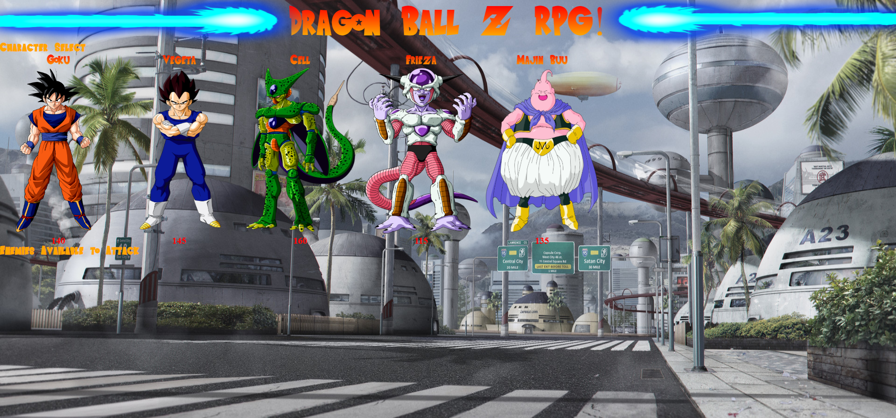

# unit-4-game

A website to play a dragon ball z themed webbrowser rpg. There are five characters to choose from and whichever characters are not seleceted are made into enemies to defeat. Every time the user attacks there characters attack power (ap) goes up by its base amount and they recieve damage equal to the enemeies counter attack power (cap) if the enemy is alive after recieving damage. The game is over if the user fails to defeat all enemies and must restart from the beginning. The player wins if they defeat all enemies while keeping there character alive. Every character also goes up by one form level, purely for looks, for every enemy the player defeats in true dragon ball fashion. They also each have their own attack sounds.

# Link to Deployed Site
- [unit-4-game](https://jakedudum.github.io/unit-4-game/)

# Built With
- [HTML](https://developer.mozilla.org/en-US/docs/Learn/HTML)
- [CSS](https://developer.mozilla.org/en-US/docs/Web/CSS)
- [Javascript](https://developer.mozilla.org/en-US/docs/Web/JavaScript)
- [Jquery](https://jquery.com/)

# Versioning
- [Github](https://github.com/)

# Authors
### Jake Dudum